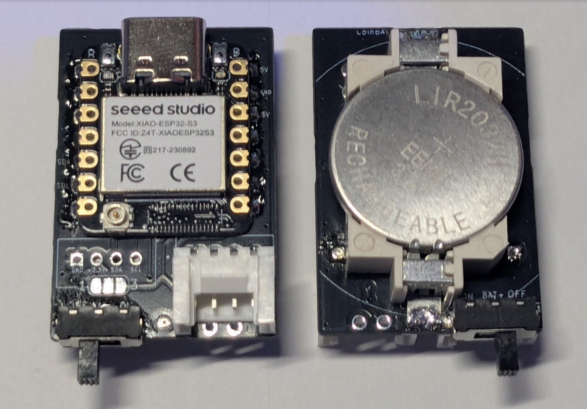

  

{width=400px}

  

# XIAO-Coin で始めるIoT開発

 

## *小型無線マイコンとセンサーで始めるIoT開発*

   

### 本書で学べること
- XIAO-Coinの組み立て
- MicroPythonによるプログラミング
- 各種センサーの活用方法
- 実践的なIoTプロジェクトの開発

  

### 対象読者
- 電子工作初心者〜中級者
- IoT開発に興味がある方
- 小型デバイスでのプロトタイピングを行いたい方

    

---

**発行日**: 2025年1月

**著者**: やわらからじお

**バージョン**: 1.0

  

 