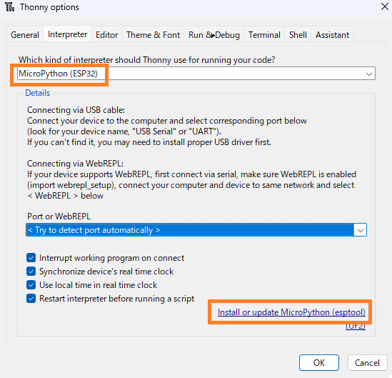
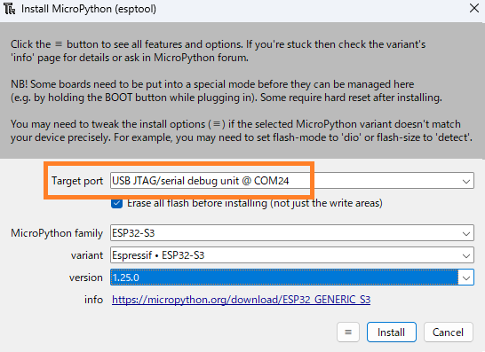
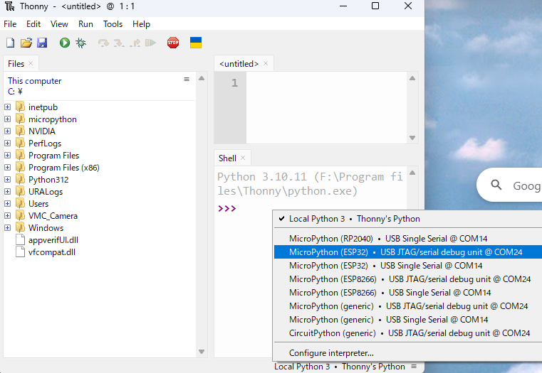
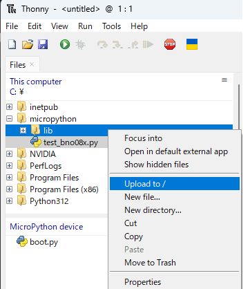
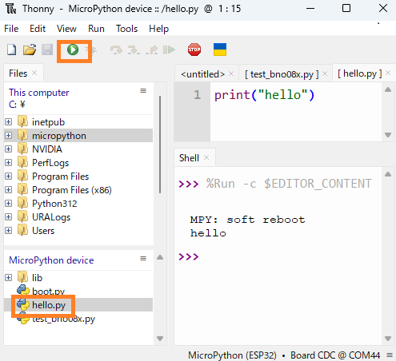
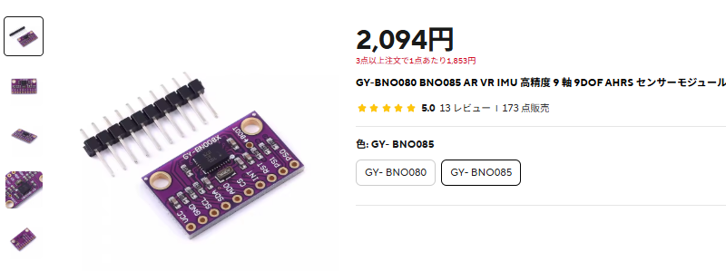
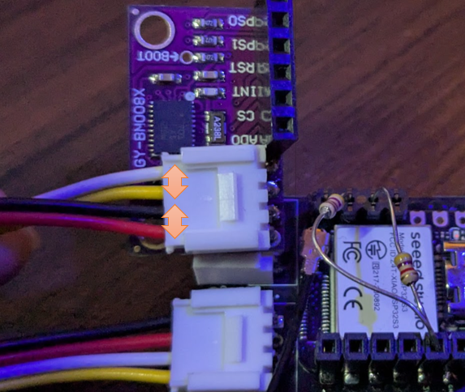
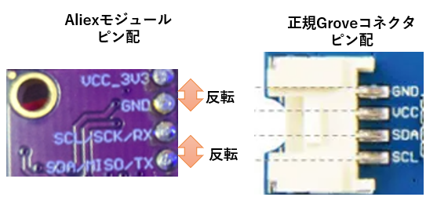
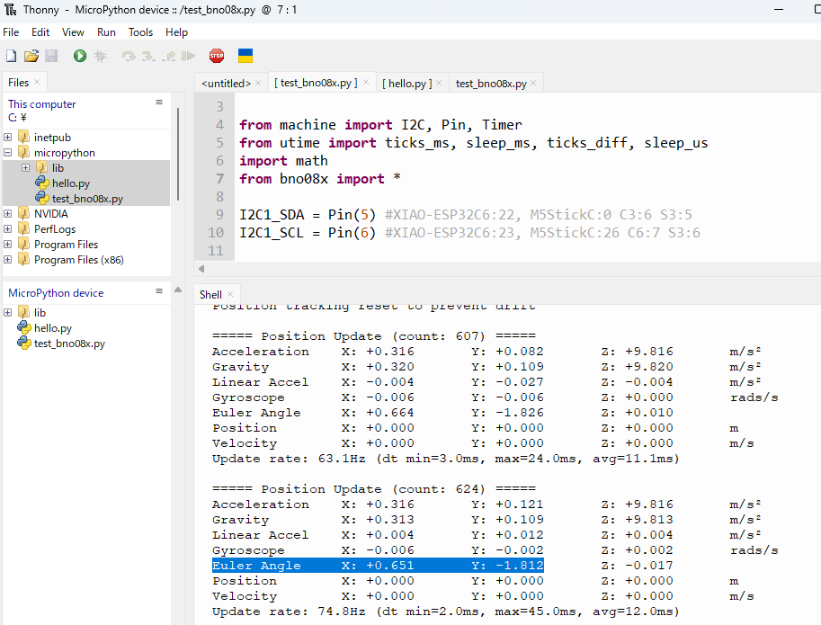

# MicroPython ESP32 開発ガイド

## 目次
1. [開発環境の準備](#開発環境の準備)
2. [Thonnyの設定](#thonnyの設定)
3. [BNO085センサーの使用方法](#bno085センサーの使用方法)
4. [実践的なプロジェクト例](#実践的なプロジェクト例)

## 開発環境の準備

### 必要なもの
- ESP32開発ボード
- BNO085センサーモジュール
- ジャンパーワイヤー
- USB-Cケーブル（ESP32による）
- PC（Windows/Mac/Linux）

### Thonnyのインストール

1. [Thonny公式サイト](https://thonny.org/)からダウンロード
2. インストーラーを実行してセットアップ


## Thonnyの設定

### MicroPythonファームウェアの書き込み

1. Thonnyメニューから「Tools」→「Options」を選択
2. 「Interpreter」タブを開く
3. 上部のドロップダウンメニューで「MicroPython (ESP32)」を選択
4. 右下の「Install or update MicroPython (esptool)」ボタンをクリック



5. **重要**: XIAO ESP32のBootボタンを押しながらUSBケーブルを接続する
   - これによりESP32がダウンロードモードに入ります
6. ポート選択画面で「USB JTAG...」と表示されているCOMポートを選択

7. ファームウェア選択画面で以下を設定：
   - **Target port**: 検出されたCOMポートが表示されていることを確認
   - **MicroPython family**: 使用するESP32に応じて選択
     - XIAO ESP32S3の場合: 「ESP32-S3」を選択
     - XIAO ESP32C3の場合: 「ESP32-C3」を選択
     - XIAO ESP32C6の場合: 「ESP32-C6」を選択
   - **Variant**: 通常は「Espressif ESP32-S3」など標準版を選択
   - **Version**: 最新の安定版を選択（通常は最上位に表示）

8. 「Install」ボタンをクリックしてファームウェアの書き込みを開始
   - 書き込み中は進行状況が表示されます
   - 完了まで数分かかる場合があります



9. 書き込み完了後、「Close」ボタンでダイアログを閉じる

**注意事項**:
- 書き込み中はUSBケーブルを抜かないでください
- エラーが発生した場合は、ESP32を再度ダウンロードモードにして再試行してください
- 初回書き込み時は既存のプログラムが消去されます

### ESP32への接続

1. XIAO EPS32のリセットボタンを押すか、USBケーブルを差し直す。
2. Thonnyで右下の"Local Python3"と表示されている個所をクリックし、適切なCOMポートを選択<br>



3. 接続確認 と ファイルアップロード
MicroPython(ESP32)と表示されていれば接続出来ている。

ファイルツリーが表示されていない場合、 View > File にて、ファイルツリーを表示する。


Githubのリポジトリからmicropythonフォルダをダウンロードし、Cドライブ直下に格納する。
https://github.com/uecken/xiao-coin

micropythonフォルダ内のファイルを選択し、アップロードする。



3. hellp.pyの動作確認
　hello.pyをダブルクリックし、再生ボタンを押す。
  コンソールに "hello" と表示されれば正常動作している。



## IMUセンサBNO085

1. 調達

* BNO085は AliExpressから購入すると安いです。
* 但しGroveコネクタを使う場合、3.3V⇔GND、SDA⇔SDLピンをそれぞれ入れ替える必要があるので注意してください。
https://ja.aliexpress.com/item/1005005902501032.html?spm=a2g0o.productlist.main.1.76313ee0UqewA3&algo_pvid=e84a5c67-44ba-44e8-b657-10176409957d&algo_exp_id=e84a5c67-44ba-44e8-b657-10176409957d-0&pdp_ext_f=%7B%22order%22%3A%22173%22%2C%22eval%22%3A%221%22%7D&pdp_npi=4%40dis%21JPY%212087%212087%21%21%21102.65%21102.65%21%402140ed7717480680463497576e6c43%2112000039594194852%21sea%21JP%211851543254%21X&curPageLogUid=CzGiY2nmisD4&utparam-url=scene%3Asearch%7Cquery_from%3A



2. 配線

- Groveコネクタを図のように配置し、3.3V⇔GND、SDA⇔SDLピンをそれぞれ入れ替えていることに注意してください。
- 一般的にI2CはSDAとSCLにプルアップ抵抗が必要です。通信が安定しない場合、3.3VとSDA、3.3VとSCLを繋ぐように4.7kΩの抵抗を接続して下さい。



 - 参考までに、Aliexpressのモジュールのピン配置、正規のGroveコネクタのピン配置を参考として示します。正規のGroveコネクタのピン配置に合わせるために、3.3V⇔GND、SDA⇔SDLピンをそれぞれ入れ替える必要があります。



3. I2CのSDAとSDLピン合わせ

I2Cのピン配置は利用するESP32のピン配置によって異なります。
```
I2C1_SDA = Pin(5) #XIAO-ESP32C6:22,  C3:6, S3:5, M5StickC:0
I2C1_SCL = Pin(6) #XIAO-ESP32C6:23,  C6:7, S3:6, M5StickC:26
```

test_bno08x.pyを選択し、実行する。


参考までに、Ceva BNO085は高精度IMUであり多くのロボットやゲーム器に採用されている。
Euler AngleのX,Yは水平角度のずれを示すので、水平器等に応用ができる。
