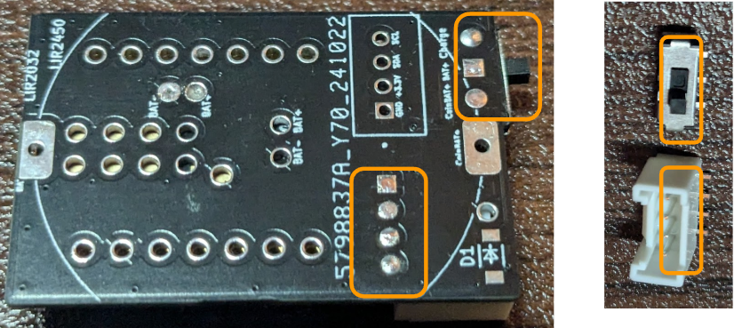

ご提示いただいたソースに基づき、Markdown形式で内容をまとめます。画像のダウンロードについては、システム上の制約により直接提供することができません。元のソースのスライドをご参照いただく形となりますことをご了承ください。

---

# XIAO-Coin 半田付け手順

ウェブサイトリンク: [https://www.switch-science.com/products/10032](https://www.switch-science.com/products/10032)

## 注意点

- CR2032電池は使えません。 (画像にはCR2032電池がバツ印と共に示されています)
- リチウム電池は使えません。
- **リチウムイオンコイン電池であるLIR2032/2450専用です**。
- **半田付けに慣れていないと難しいです**。

## 更新履歴

2025/5/23
1. XIAOと基板の充電端子を半田付けし易くするため中央部分をカットし、Castellated Holeとしました。
2. Grove端子の電源のデフォルトは3.3Vですが、Solder Jumperにより5Vを選択できるようにしました。
   またGrove端子を追加で表にもう一つ付けられるようにしました。
   (画像には基板の表と裏が示されており、変更点と思われる箇所がオレンジ色で囲まれています)

## 部品のハンダ付け手順

1. 基板にXIAOを半田付け
2. 裏面の充電端子をホール半田付け
3. 電源スイッチを半田付け
4. Grove端子を半田付け
5. バッテリーホルダーを半田付け

注: 先にバッテリーホルダーを付けると、XIAOの充電端子を半田付けできないので注意。
次ページで写真付きで説明します。

## XIAOと基板の半田付け

XIAOの片側の端子をピン固定し、反対側の端子を半田付けする。

## XIAOのはんだ付け

反対側のピンを外し、はんだ付けする。
(画像はXIAOのピンを半田付けしている様子を示しており、半田付けするピンがオレンジ色で囲まれています)

## 充電端子のホール半田付け

基板裏面の充電端子(BAT+、BAT-)をスルーホール越しに半田付けする。
→ホール半田付け
変更点：
2025年5月から基板をカットして半田付けしやすくしています。

## 充電端子のショート確認

BAT+とBAT-がショートしていない事を念のため確認する。

## 電圧確認

USBから電源供給し、充電端子間(BAT+とBAT-)で4.1～4.2V程度の電圧があることを確認する。

## 電源スイッチとGroveコネクタの半田付け

- 電源端子とGrove端子のピンを切り1mm程度とする。
- 電源端子→Grove端子の順に半田付けする（低背部品の順に半田付けする）。
- ピンが長いとバッテリーホルダーが浮いてしまうため、適切な長さで且つ半田が隆起しないよう少量とする。

## バッテリーホルダーの半田付け

バッテリーホルダーを半田付けする。
**バッテリー端子の＋/－をしっかり確認し、＋/－端子を間違えないに半田付けする**。

## 電圧確認

電源スイッチを中央側に切り替える事でXIAOとバッテリーが通電する。
バッテリー端子の＋端子と－端子間で電圧が4.1-4.2V程度ある事を確認する。

## 電池の装着

コイン電池の＋/－がショートしないよう気を付けて装着。

## 完成品

完成！
USB接続し、 __スライドスイッチを中央側__ にすると充電され、充電中はCHG LEDが点滅します
好きなセンサを接続しましょう！

## 製品紹介

 (画像は「製品紹介」のタイトルのみ)

## 用途例

## 特徴

- XIAOの小ささとLipo充電端子を生かしたコインホルダー一体型無線マイコン。
- Grove端子でその他I2Cセンサ接続可。
- 電池容量の例は45mAh ～ 120mAh (2032 ～ 2450サイズ対応)。 (ソースはこれらの容量の電池販売ページを示唆しています)
- 各種XIAOシリーズに対応 (C3, S3, C6...)。
- 別途、IMUセンサが付けられる基板販売予定。
- また、表面実装ICのカスタムセンサ基板制作のご依頼受け付けます。

## LIR2032コイン電池 70mAh

EEMB LIR2032H 充電式バッテリー 3.7V リチウムイオン コインボタン電池 70mAh
価格: ¥1,309

## 詳細

BOM,
[https://docs.google.com/spreadsheets/d/1hsU4CdXzT7cGG6bdwNirwb3Pn3HpmJ6PeojrWailB_KM/edit?usp=sharing](https://docs.google.com/spreadsheets/d/1hsU4CdXzT7cGG6bdwNirwb3Pn3HpmJ6PeojrWailB_KM/edit?usp=sharing)
Github (PCB) 準備中

## Schematics

## PCB

## BOM

| 名称 | 価格 | 販売先 | 備考 | URL |
|------|------|--------|------|-----|
| XIAO ESP32 C3/C6/S3 | 630円 | Seeed | C6 4.9$ C3 4.2$ 150円/$ | - |
| ボタン電池基板取付用ホルダー CH29-2032LF | 50円 | 秋月電子 | - | https://akizukidenshi.com/catalog/g/g108965/ |
| スライドスイッチ MK-12D13G4-B | 40$/500個 | - | - | https://www.lcsc.com/product-detail/Slide-Switches_HOOYA-MK-12D13G4-B_C20611678.html |
| Groveコネクター L型 スルーホール | 15円 | 秋月電子 | 1個 | https://akizukidenshi.com/catalog/g/g112634/ |

### コスト
#### XIAO各種モデルの単価（Seeed社から10個購入時）

XIAOの単価はC3が最も安くC3だと630円/個で試作できるため、各種センサの動作評価に向いています。私は毎回ソフトやセンサを付け替えて後で動作させるのに時間がかからないように、動作したセンサとセットで組み合わせて保管するようにしています。

| モデル | 単価（USD） | 単価（円）* |
|--------|-------------|-------------|
| XIAO ESP32 C3 | $4.20 | 630円 |
| XIAO ESP32 C6 | $4.90 | 735円 |
| XIAO ESP32 S3 | $5.40 | 810円 |

*為替レート: 1USD = 150円で計算

## 連絡先

やわらかじお
[yawaraka.radio@gmail.com](mailto:yawaraka.radio@gmail.com)

---
画像のダウンロードについては、前述の通り直接提供することができません。内容は上記のMarkdown形式でまとめましたので、ご活用ください。