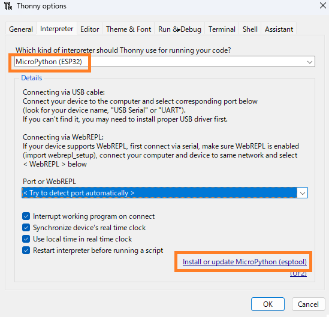
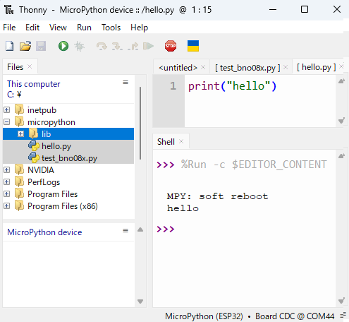
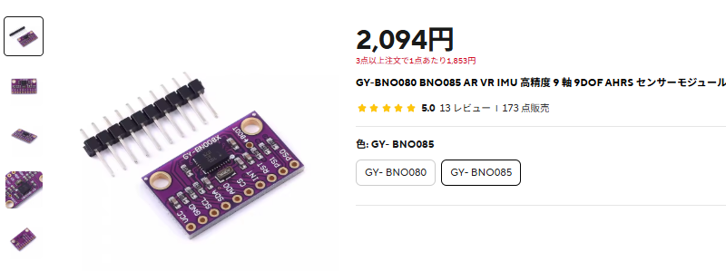
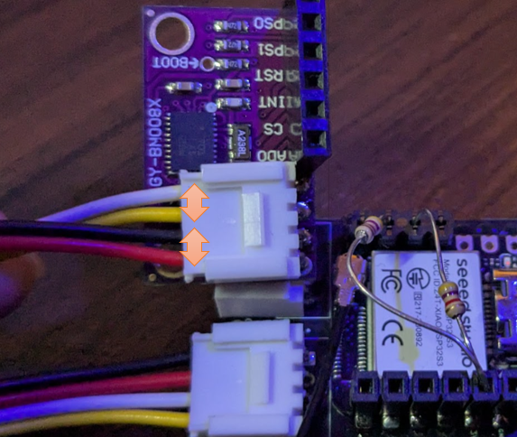
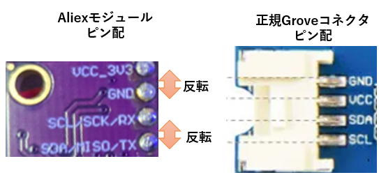

# XIAO-Coin 電子工作ガイドブック
*小型無線マイコンとセンサーで始めるIoT開発*

---

## 目次

1. [はじめに](#はじめに)
2. [XIAO-Coin基板について](#xiao-coin基板について)
3. [部品調達とコスト](#部品調達とコスト)
4. [組み立て手順](#組み立て手順)
5. [開発環境の構築](#開発環境の構築)
6. [センサー接続とプログラミング](#センサー接続とプログラミング)
7. [応用例とプロジェクト](#応用例とプロジェクト)
8. [トラブルシューティング](#トラブルシューティング)
9. [接続図とPCB](#接続図とPCB)
10. [参考資料](#参考資料)

---

## はじめに

本書は、XIAO-Coin基板を使用した小型IoTデバイスの製作から、MicroPythonによるプログラミングまでを包括的に解説するガイドブックです。

### 対象読者
- 電子工作初心者〜中級者
- IoT開発に興味がある方
- 小型デバイスでのプロトタイピングを行いたい方

### 本書で学べること
- XIAO-Coin基板の組み立て
- MicroPythonによるプログラミング
-各種センサーの活用方法
- 実践的なIoTプロジェクトの開発

---

## XIAO-Coin基板について

### 概要
XIAO-Coin基板は、Seeed Studio製XIAOマイコンとリチウムイオンコイン電池を組み合わせた、超小型の無線マイコンボードです。

**ウェブサイト**: [https://www.switch-science.com/products/10032](https://www.switch-science.com/products/10032)

### 特徴
- XIAOの小ささとLipo充電端子を生かしたコインホルダー一体型無線マイコン
- Grove端子でI2Cセンサ接続可能
- 電池容量: 45mAh〜120mAh（2032〜2450サイズ対応）
- 各種XIAOシリーズに対応（C3, S3, C6...）
- 充電機能内蔵

### 重要な注意点

⚠️ **電池に関する重要な注意**
- **CR2032電池は使用不可**
- **一般的なリチウム電池は使用不可**
- **LIR2032/2450専用**（リチウムイオンコイン電池のみ）
- **半田付けに慣れていないと組み立てが困難**

### 最新の更新内容（2025/5/23）
1. XIAOと基板の充電端子を半田付けしやすくするため中央部分をカット（Castellated Hole化）
2. Grove端子の電源をSolder Jumperで3.3V/5V選択可能に
3. Grove端子を表面にも追加可能に

---

## 部品調達とコスト

### 必要部品一覧（BOM）

| 名称 | 価格 | 販売先 | 備考 | URL |
|------|------|--------|------|-----|
| XIAO ESP32 C3/C6/S3 | 630円〜 | Seeed | 下記参照 | - |
| ボタン電池基板取付用ホルダー CH29-2032LF | 50円 | 秋月電子 | - | https://akizukidenshi.com/catalog/g/g108965/ |
| スライドスイッチ MK-12D13G4-B | 10円 | LCSC | - | https://www.lcsc.com/product-detail/Slide-Switches_HOOYA-MK-12D13G4-B_C20611678.html |
| Groveコネクター L型 スルーホール | 15円 | 秋月電子 | 1個 | https://akizukidenshi.com/catalog/g/g112634/ |

### XIAO各種モデルの単価（Seeed社から10個購入時）

| モデル | 単価（USD） | 単価（円）* | 特徴 |
|--------|-------------|-------------|------|
| XIAO ESP32 C3 | $4.20 | 630円 | 最安価、WiFi/Bluetooth対応 |
| XIAO ESP32 C6 | $4.90 | 735円 | WiFi 6対応、Thread/Zigbee対応 |
| XIAO ESP32 S3 | $5.40 | 810円 | カメラ対応、AI機能強化 |

*為替レート: 1USD = 150円で計算


- XIAOの単価はC3が最も安く、630円/個で試作できるため各種センサの動作評価に向いています。私は毎回ソフトやセンサを付け替えて後で動作させるのに時間がかからないように、動作したセンサとセットで組み合わせて保管するようにしています。
- Groveコネクタが必要だったり、充電池と電源スイッチが必要な場合、このXIAOコイン基板は向いています。


### 推奨電池
**EEMB LIR2032H 充電式バッテリー**
- 電圧: 3.7V
- 容量: 70mAh
- 価格: ¥1,309


---

## 組み立て手順

### 組み立て順序（重要）
正しい順序で組み立てないと、後の工程で作業が困難になります。

1. **基板にXIAOを半田付け**
2. **裏面の充電端子をホール半田付け**
3. **電源スイッチを半田付け**
4. **Grove端子を半田付け**
5. **バッテリーホルダーを半田付け**

⚠️ **注意**: 先にバッテリーホルダーを付けると、XIAOの充電端子を半田付けできません。

### 詳細手順

#### 1. XIAOと基板の半田付け
1. XIAOの片側の端子をピンで固定
2. 反対側の端子を半田付け
3. 固定ピンを外し、残りの端子を半田付け


#### 2. 充電端子のホール半田付け
1. 基板裏面の充電端子（BAT+、BAT-）をスルーホール越しに半田付け
2. **ショート確認**: BAT+とBAT-がショートしていないことを確認
3. **電圧確認**: USB電源供給時、充電端子間で4.1〜4.2V程度の電圧を確認


#### 3. 電源スイッチとGroveコネクタの半田付け
- 電源端子とGrove端子のピンを1mm程度にカット
- 低背部品から順に半田付け（電源端子→Grove端子）
- ピンが長いとバッテリーホルダーが浮くため、適切な長さで半田の隆起を最小限に


#### 4. バッテリーホルダーの半田付け
- **極性確認**: バッテリー端子の+/-を確実に確認
- +/-端子を間違えないよう注意深く半田付け


#### 5. 最終確認
1. 電源スイッチを中央側に切り替え
2. バッテリー端子間で4.1〜4.2V程度の電圧を確認
3. コイン電池の+/-がショートしないよう注意して装着


電池を入れる際、+/-がショートしないように気を付けてください。
ショートしにくいバッテリーホルダ―を選定していますが、注意してください。


### 完成品


---

## 開発環境の構築

### 必要なソフトウェア
- **Thonny IDE**: MicroPython開発環境
- **MicroPythonファームウェア**: ESP32用

### Thonnyのインストールと設定

#### 1. Thonnyのインストール
1. [Thonny公式サイト](https://thonny.org/)からダウンロード
2. インストーラーを実行してセットアップ

#### 2. MicroPythonファームウェアの書き込み

下記6ステップを順に行ってください。

  - Thonnyメニュー「Tools」→「Options」
  - 「MicroPython(ESP32)」を選択
  - 「Install or update MicroPython(esptool)」を選択
  - XIAO ESP32のBootボタンを押しながらUSB接続 (ブートモードにする必要があります。)



  - 適切なCOMポートを選択
  - ESP32用ファームウェアを選択してInstall


#### 3. ESP32への接続
- XIAO ESP32のリセットボタンを押すかUSB再接続した後,
Thonny右下の接続先を適切なCOMポートに変更します
- 「MicroPython(ESP32)」と表示されれば接続成功です


#### 4. ファイルのアップロード
 - 「View」→「Files」でファイルツリーを表示


 - micropythonプロジェクトファイルをESP32にアップロード
   - Githubのリポジトリからmicropythonフォルダをダウンロードし、Cドライブ直下に格納してからアップロードしてください
https://github.com/uecken/xiao-coin



#### ５．テストプログラムの実行

- 再生ボタンを押し、Helloと表示されれば動作しています。


---

## センサー接続とプログラミング

### BNO085 IMUセンサーの使用

#### センサーの調達


 - BNO085は AliExpressから購入すると安いです。
 - 但しGroveコネクタを使う場合、3.3V⇔GND、SDA⇔SDLピンをそれぞれ入れ替える必要があるので注意してください。

- URL: https://ja.aliexpress.com/item/1005005902501032.html



#### 配線方法
⚠️ **重要な配線注意点**
 - 参考までに、Aliexpressのモジュールのピン配置、正規のGroveコネクタのピン配置を参考として示します。正規のGroveコネクタのピン配置に合わせるために、3.3V⇔GND、SDA⇔SDLピンをそれぞれ入れ替える必要があります

 - 一般的にI2CはSDAとSCLにプルアップ抵抗が必要です。通信が安定しない場合、3.3VとSDA、3.3VとSCLを繋ぐように4.7kΩの抵抗を接続して下さい。






#### サンプルプログラム

サンプルプログラムは下記に格納しています。
https://github.com/uecken/xiao-coin/blob/main/micropython/test_bno08x_simple.py

```python
# BNO08x Micropython I2C Test program - Simplified version
# Basic sensor data display only

from machine import I2C, Pin
from utime import sleep_ms
from bno08x import *

# I2Cピン設定（ESP32モデル別）
I2C1_SDA = Pin(5)  # XIAO-ESP32 S3:5, C6:22, C3:6
I2C1_SCL = Pin(6)  # XIAO-ESP32 S3:6, C6:23, C3:7

# I2C初期化
i2c1 = I2C(0, scl=I2C1_SCL, sda=I2C1_SDA, freq=400000, timeout=200000)

# BNO085センサー初期化
bno = BNO08X(i2c1, debug=False)
print("BNO08x I2C connection : Done\n")

# センサー機能を有効化
bno.enable_feature(BNO_REPORT_ACCELEROMETER, 50)        # 加速度センサー 50ms間隔
bno.enable_feature(BNO_REPORT_GYROSCOPE, 50)            # ジャイロスコープ 50ms間隔
bno.enable_feature(BNO_REPORT_GAME_ROTATION_VECTOR, 50) # ゲーム回転ベクトル 50ms間隔
bno.enable_feature(BNO_REPORT_GRAVITY, 50)              # 重力ベクトル 50ms間隔

# オイラー角とクォータニオンの設定
bno.set_quaternion_euler_vector(BNO_REPORT_GAME_ROTATION_VECTOR)

print("BNO08x sensors enabling : Done\n")
print("Starting sensor data display in 3 seconds...")
sleep_ms(3000)

# 初期キャリブレーション
bno.calibration()
print("Initial sensor calibration complete")
sleep_ms(1000)

# 姿勢の零点調整
bno.tare()
print("Tare operation complete - current orientation set as reference")
sleep_ms(1000)

print("\n===== Starting sensor data display =====\n")

# メインループ
count = 0
while True:
    count += 1
    
    print(f"===== Sensor Data Update #{count} =====")
    
    # 加速度データ（重力込み）
    accel_x, accel_y, accel_z = bno.acc
    print(f"Acceleration\tX: {accel_x:+.3f}\tY: {accel_y:+.3f}\tZ: {accel_z:+.3f}\tm/s²")
    
    # 重力ベクトル
    grav_x, grav_y, grav_z = bno.gravity
    print(f"Gravity\t\tX: {grav_x:+.3f}\tY: {grav_y:+.3f}\tZ: {grav_z:+.3f}\tm/s²")
    
    # 線形加速度（重力補正済み）
    linear_x = accel_x - grav_x
    linear_y = accel_y - grav_y
    linear_z = accel_z - grav_z
    print(f"Linear Accel\tX: {linear_x:+.3f}\tY: {linear_y:+.3f}\tZ: {linear_z:+.3f}\tm/s²")
    
    # ジャイロスコープ（角速度）
    gyro_x, gyro_y, gyro_z = bno.gyro
    print(f"Gyroscope\tX: {gyro_x:+.3f}\tY: {gyro_y:+.3f}\tZ: {gyro_z:+.3f}\trad/s")
    
    # オイラー角（Roll, Pitch, Yaw）
    roll, pitch, yaw = bno.euler
    print(f"Euler Angle\tRoll: {roll:+.3f}\tPitch: {pitch:+.3f}\tYaw: {yaw:+.3f}\trad")
    
    # クォータニオン
    quat_w, quat_x, quat_y, quat_z = bno.quaternion
    print(f"Quaternion\tW: {quat_w:+.3f}\tX: {quat_x:+.3f}\tY: {quat_y:+.3f}\tZ: {quat_z:+.3f}")
    
    print()  # 空行
    
    # 1秒間隔で表示
    sleep_ms(1000) 

```


### 出力データの解説

```
===== Sensor Data Update #42 =====
Acceleration	X: -3.016	Y: -8.043	Z: -4.281	m/s²
Gravity		X: -3.023	Y: -8.047	Z: -4.281	m/s²
Linear Accel	X: +0.008	Y: +0.004	Z: +0.000	m/s²
Gyroscope	X: +0.008	Y: -0.008	Z: +0.008	rad/s
Euler Angle	Roll: -118.298	Pitch: +18.422	Yaw: -33.818	rad
Quaternion	W: -0.787	X: +0.325	Y: -0.016	Z: +0.524
```


参考までに、重力加速度を除いたLinear Accel（線形加速度）が取れるので正しく使えばある程度の相対位置測位に利用できます。

- **意味**: 重力を除いた純粋な加速度（Acceleration - Gravity）
- **単位**: m/s²
- **値の解釈**:
  - X: +0.008 m/s² → ほぼゼロ（静止状態）
  - Y: +0.004 m/s² → ほぼゼロ（静止状態）
  - Z: +0.000 m/s² → 完全にゼロ（静止状態）
- **用途**: 物体の実際の動きの検出、歩数計、振動検知


#### 実用的な活用例

**1. 水平器**
```python
# Euler AngleのX, Y成分で水平からの傾きを検出
tilt_x = roll * 180 / 3.14159  # ラジアンを度に変換
tilt_y = pitch * 180 / 3.14159
```

**2. 動作検出**
```python
# Linear Accelの大きさで動きを検出
motion_magnitude = (linear_x**2 + linear_y**2 + linear_z**2)**0.5
if motion_magnitude > 0.5:  # 閾値
    print("Motion detected!")
```


## トラブルシューティング


### よくある問題と解決方法

#### 電源関連
- **充電されない**: 電池の極性、充電端子の半田付けを確認してください
- **電圧が出ない**: ショートの有無、スイッチの位置を確認してください

#### 通信関連
- **I2C通信エラー**: プルアップ抵抗の追加や配線を確認してください


## 接続図とPCB

  - ソルダージャンパーは通常3.3Vに繋がっていますが、カットして5V側に半田付けする事でGroveの電源を5Vで駆動出来ます。
  - 中央を四角にカットしているので、XIAOの裏面の充電端子と半田付けしやすくなっています。
  - KiCADファイルを公開しているので、XIAO Coinを沢山つかったり、カスタマイズする際にご利用下さい。PR頂けると嬉しいです。
    -  KiCAD: https://github.com/uecken/xiao-coin/tree/main/XIAO_ButtonBatteryPCB_Public 
  - GerverデータをJLCPCBにアップロードして発注すれば5枚3$で約一週間で到着します。
    - Gerver: https://github.com/uecken/xiao-coin/blob/main/XIAO_ButtonBatteryPCB_Pulic/production/XIAO_ButtonBatteryPCB_v0.4.zip


---

## 参考資料

### 公式リソース
- **参考BOM**: [Google Spreadsheet](https://docs.google.com/spreadsheets/d/1hsU4CdXzT7cGG6bdwNirwb3Pn3HpmJ6PeojrWailB_KM/edit?usp=sharing)
- **GitHub**: PCB設計ファイル（準備中）
- **Switch Science**: [製品ページ](https://www.switch-science.com/products/10032)

### 開発ツール
- **Thonny IDE**: [https://thonny.org/](https://thonny.org/)
- **MicroPython**: [https://micropython.org/](https://micropython.org/)


## 連絡先・サポート

**やわらかじお**
- Email: [yawaraka.radio@gmail.com](mailto:yawaraka.radio@gmail.com)
- カスタムセンサ基板制作のご依頼も承ります

---

*本書は電子工作の安全性に十分注意して作成されていますが、作業は自己責任で行ってください。特に半田付け作業では火傷や有害ガスに注意し、適切な換気と保護具の使用を心がけてください。*

---

**© 2025 やわらからじお - XIAO-Coin電子工作ガイドブック** 