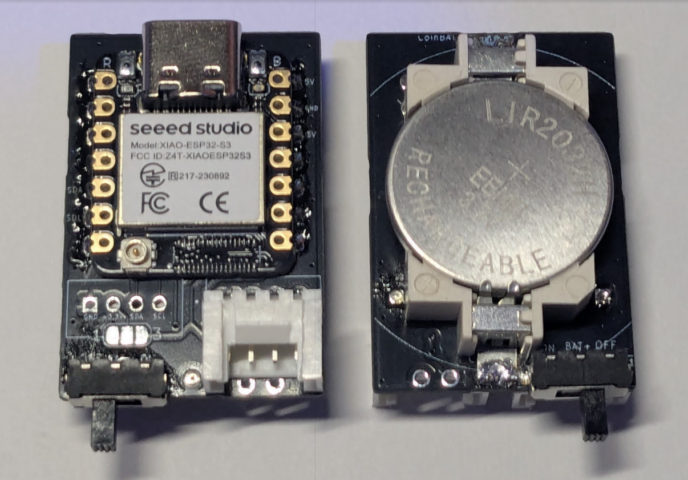
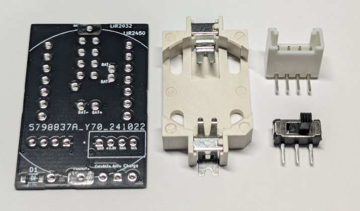
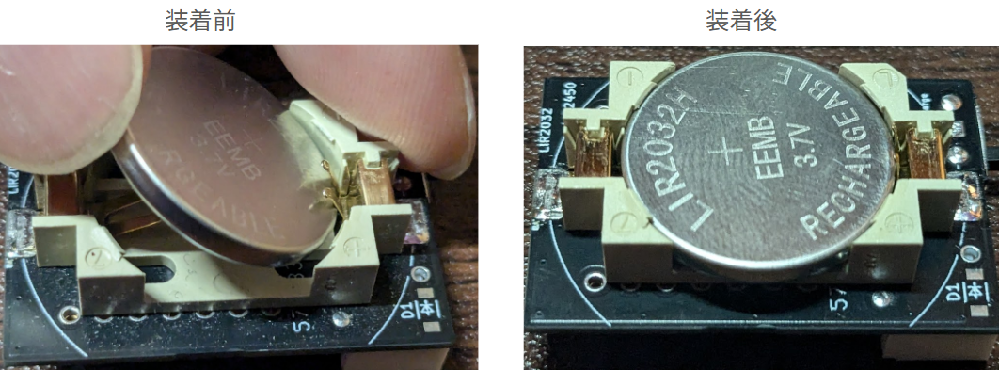
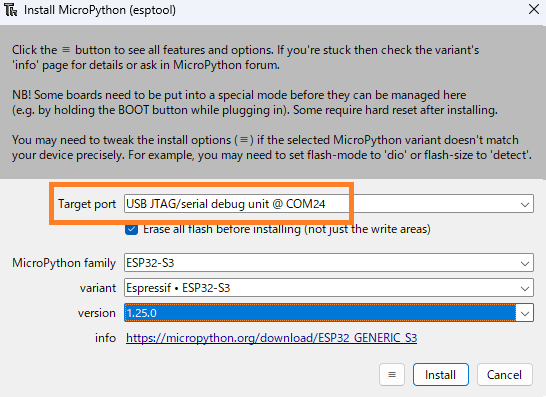
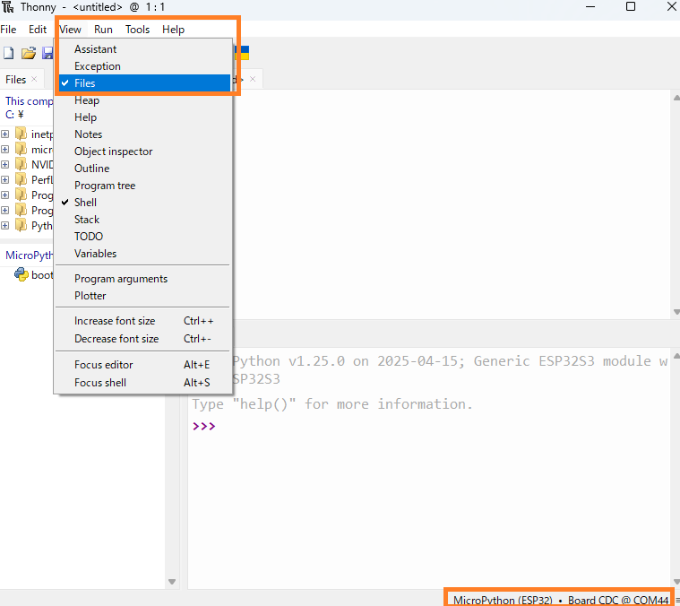
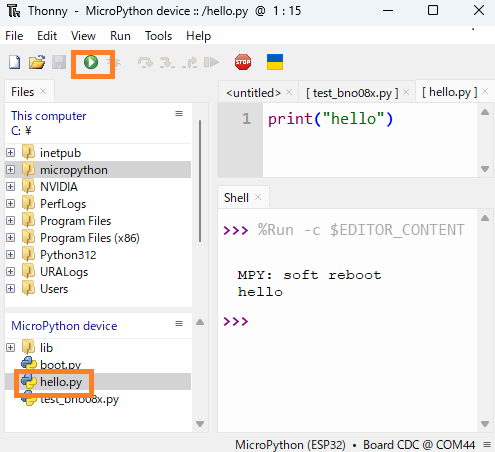
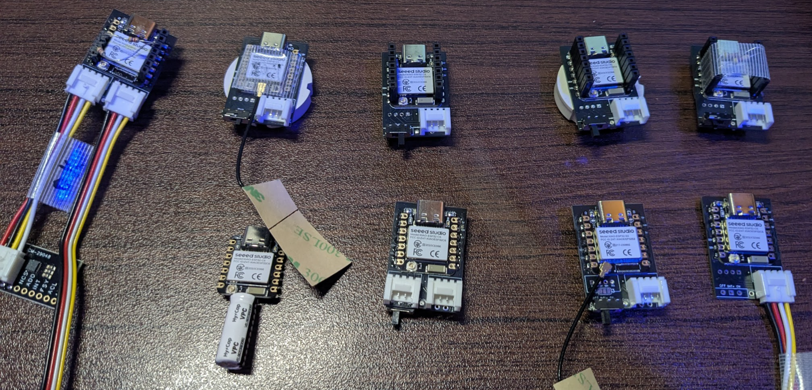

<div style="text-align: center; page-break-after: always;">

<br><br>

::: {=latex}
\centering
\Huge \textbf{XIAO-Coinで始めるIoT}
\vspace{4cm}
:::

<br><br>

{width=500px}

<br><br>

::: {=latex}
\centering
\Large \textbf{やわらからじお}

\normalsize
\raggedright
:::

</div>


::: {=latex}
\newpage
:::


------------------------------------------------------------------------

目次
----

1.  [はじめに](#はじめに)
2.  [XIAO-Coinについて](#xiao-coinについて)
3.  [部品とコスト](#部品とコスト)
4.  [組み立て手順](#組み立て手順)
5.  [開発環境の構築](#開発環境の構築)
6.  [センサー接続とプログラミング](#センサー接続とプログラミング)
7.  [応用例とプロジェクト](#応用例とプロジェクト)
8.  [トラブルシューティング](#トラブルシューティング)
9.  [接続図とPCB](#接続図とPCB)
10. [参考資料](#参考資料)


はじめに
--------

本書は、XIAO-Coinを使用した小型充電式無線マイコン、並びにMicroPythonによる簡易なプログラミング解説するガイドブックです。

### 対象読者

-   電子工作初心者ー中級者
-   小型デバイスでのプロトタイピングを行いたい方

### 本書で学べること

-   XIAO-Coinの組み立て
-   MicroPythonによるプログラミング -各種センサーの活用方法

#### 注意点

  - **CR2032電池は使用できません** 
  - **一般的なリチウム電池は使用できません** 
  - **LIR2032/2450専用です**（リチウムイオンコイン電池のみ） 
  - **半田付けに慣れている必要があります**


::: {=latex}
\newpage
:::


XIAO-Coinについて
---------------------

### 概要

XIAO-Coinは、リチウムイオン充電機能のあるSeeed Studio製XIAOとリチウムイオンコイン電池を組み合わせた、小型（38mm x 28mm）の無線マイコンボードです。

オンラインで基板セットを販売しています。GitHubでKiCADファイルを公開していますので、気に入った方は沢山創ったり、カスタマイズして是非ご利用ください。

**スイッチサイエンス販売サイト**: <https://www.switch-science.com/products/10032>

{width=300px}

### 特徴

-   XIAOの小ささとLipo充電端子を生かしたコインホルダー一体型無線マイコン
-   Grove端子でI2Cセンサ接続可能
-   充電機能内蔵のため各種コイン電池に対応：45mAh〜120mAh（2032〜2450サイズ）

::: {=latex}
\newpage
:::


必要部品とコスト
----------------

### 必要部品一覧（BOM）

- XIAOの単価はC3が最も安く、630円/個で試作できるため各種センサの動作評価に向いています。
- これだけ安ければ動作したセンサとセットでそのままにしておけるので、毎回ソフトやセンサを付け替える必要が無いのが便利です。

| 名称 | 価格 | 販売先 | 備考 |
|------|------|--------|------|
| XIAO ESP32 C3/C6/S3 | 630円〜810円 | Seeed | 10個購入時の値段  |
| ボタン電池基板取付用ホルダー CH29-2032LF | 50円 | 秋月電子 |
| スライドスイッチ MK-12D13G4-B | 10円 | LCSC | 
| Groveコネクター L型 スルーホール | 15円 | 秋月電子 | 

### XIAO各種モデルの単価（Seeed社から10個購入時）

| モデル | 単価（USD） | 単価（円）* | 特徴 |
|--------|-------------|-------------|------|
| XIAO ESP32 C3 | $4.20 | 630円 | 最安価、WiFi/Bluetooth対応 |
| XIAO ESP32 C6 | $4.90 | 735円 | WiFi 6対応、Thread/Zigbee対応 |
| XIAO ESP32 S3 | $5.40 | 810円 | カメラ対応、AI機能強化 |

*為替レート: 1USD = 150円で計算


### 推奨電池


EEMB LIR2032H 充電式バッテリー - 電圧: 3.7V - 容量: 70mAh - 価格:
¥1,309

{width=300px}

::: {=latex}
\newpage
:::


組み立て手順
------------

## 部品のハンダ付け手順


1. 基板にXIAOを半田付け
2. 裏面の充電端子をホール半田付け
3. 電源スイッチを半田付け
4. Grove端子を半田付け
5. バッテリーホルダーを半田付け

注: 先にバッテリーホルダーを付けると、XIAOの充電端子を半田付けできないので注意。
次ページで写真付きで説明します。

## XIAOと基板の半田付け
  - XIAOの片側の端子をピン固定し、反対側の端子を半田付けする。

{width=300px}

## XIAOのはんだ付け
  - 反対側のピンを外し、はんだ付けする。

{width=300px}

::: {=latex}
\newpage
:::

## 充電端子のホール半田付け
  - 基板裏面の充電端子(BAT+、BAT-)をスルーホール越しに半田付けする。（ホール半田付け）
  - 2025年5月から基板をカットして半田付けしやすくしています。

{width=300px}

## 充電端子のショート確認
  - BAT+とBAT-がショートしていない事を念のため確認する。

{width=300px}

## 電圧確認
  - USBから電源供給し、充電端子間(BAT+とBAT-)で4.1～4.2V程度の電圧があることを確認する。

{width=300px}

::: {=latex}
\newpage
:::

## 電源スイッチとGroveコネクタの半田付け

- 電源端子とGrove端子のピンを切り1mm程度とする。
- 電源端子→Grove端子の順に半田付けする（低背部品の順に半田付けする）。
- ピンが長いとバッテリーホルダーが浮いてしまうため、適切な長さで且つ半田が隆起しないよう少量とする。

{width=300px}


## バッテリーホルダーの半田付け
- バッテリーホルダーを半田付けする。
**バッテリー端子の＋/－をしっかり確認し、＋/－端子を間違えないに半田付けする**。

{width=300px}

::: {=latex}
\newpage
:::

## 電圧確認
- 電源スイッチを中央側に切り替える事でXIAOとバッテリーが通電する。
- バッテリー端子の＋端子と－端子間で電圧が4.1-4.2V程度ある事を確認する。

{width=300px}

## 電池の装着

- コイン電池の＋/－がショートしないよう気を付けて装着。

{width=300px}

## 完成品

<div style="text-align: center;">

完成！

USB接続し、 __スライドスイッチを中央側__ にすると充電され、充電中はCHG LEDが点滅します

好きなセンサを接続しましょう！

{width=300px}

</div>

::: {=latex}
\newpage
:::


開発環境の構築
--------------

### Thonnyのインストールと設定

#### 1. Thonnyのインストール

1.  [Thonny公式サイト](https://thonny.org/)からダウンロード
2.  インストーラーを実行してセットアップ

#### 2. MicroPythonファームウェアの書き込み

下記6ステップを順に行ってください。

-   Thonnyメニュー「Tools」→「Options」
-   「MicroPython(ESP32)」を選択
-   「Install or update MicroPython(esptool)」を選択

{width=300px}

-   XIAO ESP32のBootボタンを押しながらUSB接続
    (ブートモードにする必要があります。)
-   適切なCOMポートを選択(USB/JTAGとついているものを選びます)
-   ESP32用ファームウェアを選択してInstall

{width=300px}

::: {=latex}
\newpage
:::

#### 3. ESP32への接続

-   XIAO ESP32のリセットボタンを押すかUSB再接続した後,
    Thonny右下の接続先を適切なCOMポートに変更します
-   「MicroPython(ESP32)」と表示されれば接続成功です

{width=350px}

#### 4. ファイルのアップロード

-   「View」→「Files」でファイルツリーを表示

{width=350px}

-   micropythonプロジェクトファイルをESP32にアップロード
    -   Githubのリポジトリからmicropythonフォルダをダウンロードし、Cドライブ直下に格納してからアップロードしてください
        https://github.com/uecken/xiao-coin

{width=300px}


::: {=latex}
\newpage
:::

#### ５．テストプログラムの実行

-   再生ボタンを押し、Helloと表示されれば動作しています。

{width=300px}

::: {=latex}
\newpage
:::


センサー接続とプログラミング
----------------------------

### BNO085 IMUセンサーの使用

#### センサーの調達

-   BNO085は AliExpressから購入すると安いです。

-   但しGroveコネクタを使う場合、3.3V--GND、SDA--SDLピンをそれぞれ入れ替える必要があるので注意してください。

-   URL: https://ja.aliexpress.com/item/1005005902501032.html

{width=300px}


#### 配線方法

- 参考までに、Aliexpressのモジュールのピン配置、正規のGroveコネクタのピン配置を参考として示します。正規のGroveコネクタのピン配置に合わせるために、3.3V--GND、SDA--SDLピンをそれぞれ入れ替える必要があります

- 一般的にI2CはSDAとSCLにプルアップ抵抗が必要です。通信が安定しない場合、3.3VとSDA、3.3VとSCLを繋ぐように4.7kΩの抵抗を接続して下さい。

{width=250px}

{width=300px}

::: {=latex}
\newpage
:::

#### サンプルプログラム

- サンプルプログラムは下記に格納しています。
- https://github.com/uecken/xiao-coin/blob/main/micropython/test\_bno08x\_simple.py


``` {.python}
# BNO08x Micropython I2C Test program - Simplified version
# Basic sensor data display only

from machine import I2C, Pin
from utime import sleep_ms
from bno08x import *

# I2Cピン設定（ESP32モデル別）
I2C1_SDA = Pin(5)  # XIAO-ESP32 S3:5, C6:22, C3:6
I2C1_SCL = Pin(6)  # XIAO-ESP32 S3:6, C6:23, C3:7

# I2C初期化
i2c1 = I2C(0, scl=I2C1_SCL, sda=I2C1_SDA, freq=400000, timeout=200000)

# BNO085センサー初期化
bno = BNO08X(i2c1, debug=False)
print("BNO08x I2C connection : Done\n")

# センサー機能を有効化
bno.enable_feature(BNO_REPORT_ACCELEROMETER, 50)        # 加速度センサー 50ms間隔
bno.enable_feature(BNO_REPORT_GYROSCOPE, 50)            # ジャイロスコープ 50ms間隔
bno.enable_feature(BNO_REPORT_GAME_ROTATION_VECTOR, 50) # ゲーム回転ベクトル 50ms間隔
bno.enable_feature(BNO_REPORT_GRAVITY, 50)              # 重力ベクトル 50ms間隔

# オイラー角とクォータニオンの設定
bno.set_quaternion_euler_vector(BNO_REPORT_GAME_ROTATION_VECTOR)

print("BNO08x sensors enabling : Done\n")
print("Starting sensor data display in 3 seconds...")
sleep_ms(3000)

# 初期キャリブレーション
bno.calibration()
print("Initial sensor calibration complete")
sleep_ms(1000)

# 姿勢の零点調整
bno.tare()
print("Tare operation complete - current orientation set as reference")
sleep_ms(1000)

print("\n===== Starting sensor data display =====\n")

# メインループ
count = 0
while True:
    count += 1
    
    print(f"===== Sensor Data Update #{count} =====")
    
    # 加速度データ（重力込み）
    accel_x, accel_y, accel_z = bno.acc
    print(f"Acceleration\tX: {accel_x:+.3f}\tY: {accel_y:+.3f}\tZ: {accel_z:+.3f}\tm/s²")
    
    # 重力ベクトル
    grav_x, grav_y, grav_z = bno.gravity
    print(f"Gravity\t\tX: {grav_x:+.3f}\tY: {grav_y:+.3f}\tZ: {grav_z:+.3f}\tm/s²")
    
    # 線形加速度（重力補正済み）
    linear_x = accel_x - grav_x
    linear_y = accel_y - grav_y
    linear_z = accel_z - grav_z
    print(f"Linear Accel\tX: {linear_x:+.3f}\tY: {linear_y:+.3f}\tZ: {linear_z:+.3f}\tm/s²")
    
    # ジャイロスコープ（角速度）
    gyro_x, gyro_y, gyro_z = bno.gyro
    print(f"Gyroscope\tX: {gyro_x:+.3f}\tY: {gyro_y:+.3f}\tZ: {gyro_z:+.3f}\trad/s")
    
    # オイラー角（Roll, Pitch, Yaw）
    roll, pitch, yaw = bno.euler
    print(f"Euler Angle\tRoll: {roll:+.3f}\tPitch: {pitch:+.3f}\tYaw: {yaw:+.3f}\trad")
    
    # クォータニオン
    quat_w, quat_x, quat_y, quat_z = bno.quaternion
    print(f"Quaternion\tW: {quat_w:+.3f}\tX: {quat_x:+.3f}\tY: {quat_y:+.3f}\tZ: {quat_z:+.3f}")
    
    print()  # 空行
    
    # 1秒間隔で表示
    sleep_ms(1000) 
```

{width=500px}

### 出力データの解説


    ===== Sensor Data Update #42 =====
    Acceleration    X: -3.016   Y: -8.043   Z: -4.281   m/s²
    Gravity     X: -3.023   Y: -8.047   Z: -4.281   m/s²
    Linear Accel    X: +0.008   Y: +0.004   Z: +0.000   m/s²
    Gyroscope   X: +0.008   Y: -0.008   Z: +0.008   rad/s
    Euler Angle Roll: -118.298  Pitch: +18.422  Yaw: -33.818    rad
    Quaternion  W: -0.787   X: +0.325   Y: -0.016   Z: +0.524

<br>

参考までに、重力加速度を除いたLinear
Accel（線形加速度）が取れるので正しく使えばある程度の相対位置測位に利用できます。

-   **意味**: 重力を除いた純粋な加速度（Acceleration - Gravity）
-   **単位**: m/s²
-   **値の解釈**:
    -   X: +0.008 m/s² → ほぼゼロ（静止状態）
    -   Y: +0.004 m/s² → ほぼゼロ（静止状態）
    -   Z: +0.000 m/s² → 完全にゼロ（静止状態）
-   **用途**: 物体の実際の動きの検出、歩数計、振動検知

#### 実用的な活用例

**1. 水平器**

``` {.python}
# Euler AngleのX, Y成分で水平からの傾きを検出
tilt_x = roll * 180 / 3.14159  # ラジアンを度に変換
tilt_y = pitch * 180 / 3.14159
```

**2. 動作検出**

``` {.python}
# Linear Accelの大きさで動きを検出
motion_magnitude = (linear_x**2 + linear_y**2 + linear_z**2)**0.5
if motion_magnitude > 0.5:  # 閾値
    print("Motion detected!")
```

::: {=latex}
\newpage
:::


接続図とPCB
-----------

-   ソルダージャンパーは通常3.3Vに繋がっていますが、カットして5V側に半田付けする事でGroveの電源を5Vで駆動出来ます。
-   中央を四角にカットしているので、XIAOの裏面の充電端子と半田付けしやすくなっています。
-   KiCADファイルを公開しているので、XIAO
    Coinを沢山つかったり、カスタマイズする際にご利用下さい。PR頂けると嬉しいです。
    -   KiCAD:
        https://github.com/uecken/xiao-coin/tree/main/XIAO\_ButtonBatteryPCB\_Public
-   GerverデータをJLCPCBにアップロードして発注すれば5枚3$で約一週間で到着します。
    - [Gerber URL](https://github.com/uecken/xiao-coin/blob/main/XIAO_ButtonBatteryPCB_Pulic/production/XIAO_ButtonBatteryPCB_v0.4.zip)

{width=400px}

{width=400px}

::: {=latex}
\newpage
:::


### トラブルシューティング

-   **充電されない**: 電池の極性、充電端子の半田付けを確認してください
-   **電圧が出ない**: ショートの有無、スイッチの位置を確認してください
-   **I2C通信エラー**: プルアップ抵抗の追加や配線を確認してください


### 参考資料

-   **GitHub**: https://github.com/uecken/xiao-coin/tree/main


### 最新の更新内容（2025/5/23）

1.  XIAOと基板の充電端子を半田付けしやすくするため中央部分をカット（Castellated
    Hole化）
2.  Grove端子の電源をSolder Jumperで3.3V/5V選択可能に
3.  Grove端子を表面にも追加可能に

連絡先・サポート
----------------

**やわらからじお** 
- Email: <yawaraka.radio@gmail.com> 


::: {=latex}
\newpage
:::


::: {=latex}
\vspace*{\fill}
\centering
:::

{width=600px}

::: {=latex}
\vspace*{\fill}
\centering
:::

**© 2025 やわらからじお - XIAO-Coinで始めるIoT**

::: {=latex}
\normalsize
\raggedright
:::

</div>
