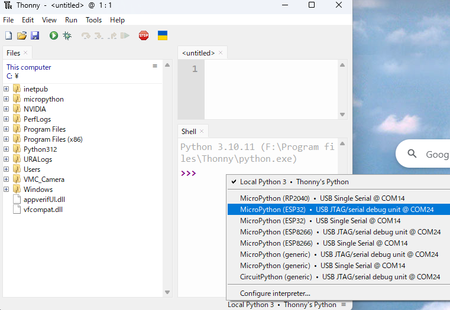

# XIAO-Coin 電子工作ガイドブック
*小型無線マイコンとセンサーで始めるIoT開発*

---

## 目次

1. [はじめに](#はじめに)
2. [XIAO-Coin基板について](#xiao-coin基板について)
3. [部品調達とコスト](#部品調達とコスト)
4. [組み立て手順](#組み立て手順)
5. [開発環境の構築](#開発環境の構築)
6. [センサー接続とプログラミング](#センサー接続とプログラミング)
7. [応用例とプロジェクト](#応用例とプロジェクト)
8. [トラブルシューティング](#トラブルシューティング)
9. [参考資料](#参考資料)

---

## はじめに

本書は、XIAO-Coin基板を使用した小型IoTデバイスの製作から、MicroPythonによるプログラミングまでを包括的に解説するガイドブックです。

### 対象読者
- 電子工作初心者〜中級者
- IoT開発に興味がある方
- 小型デバイスでのプロトタイピングを行いたい方

### 本書で学べること
- XIAO-Coin基板の組み立て
- MicroPythonによるプログラミング
-各種センサーの活用方法
- 実践的なIoTプロジェクトの開発

---

## XIAO-Coin基板について

### 概要
XIAO-Coin基板は、Seeed Studio製XIAOマイコンとリチウムイオンコイン電池を組み合わせた、超小型の無線マイコンボードです。

**ウェブサイト**: [https://www.switch-science.com/products/10032](https://www.switch-science.com/products/10032)

### 特徴
- XIAOの小ささとLipo充電端子を生かしたコインホルダー一体型無線マイコン
- Grove端子でI2Cセンサ接続可能
- 電池容量: 45mAh〜120mAh（2032〜2450サイズ対応）
- 各種XIAOシリーズに対応（C3, S3, C6...）
- 充電機能内蔵

### 重要な注意点

⚠️ **電池に関する重要な注意**
- **CR2032電池は使用不可**
- **一般的なリチウム電池は使用不可**
- **LIR2032/2450専用**（リチウムイオンコイン電池のみ）
- **半田付けに慣れていないと組み立てが困難**

### 最新の更新内容（2025/5/23）
1. XIAOと基板の充電端子を半田付けしやすくするため中央部分をカット（Castellated Hole化）
2. Grove端子の電源をSolder Jumperで3.3V/5V選択可能に
3. Grove端子を表面にも追加可能に


### 回路図とPCB設計


---

## 部品調達とコスト

### 必要部品一覧（BOM）

| 名称 | 価格 | 販売先 | 備考 | URL |
|------|------|--------|------|-----|
| XIAO ESP32 C3/C6/S3 | 630円〜 | Seeed | 下記参照 | - |
| ボタン電池基板取付用ホルダー CH29-2032LF | 50円 | 秋月電子 | - | https://akizukidenshi.com/catalog/g/g108965/ |
| スライドスイッチ MK-12D13G4-B | 40$/500個 | LCSC | - | https://www.lcsc.com/product-detail/Slide-Switches_HOOYA-MK-12D13G4-B_C20611678.html |
| Groveコネクター L型 スルーホール | 15円 | 秋月電子 | 1個 | https://akizukidenshi.com/catalog/g/g112634/ |

### XIAO各種モデルの単価（Seeed社から10個購入時）

| モデル | 単価（USD） | 単価（円）* | 特徴 |
|--------|-------------|-------------|------|
| XIAO ESP32 C3 | $4.20 | 630円 | 最安価、WiFi/Bluetooth対応 |
| XIAO ESP32 C6 | $4.90 | 735円 | WiFi 6対応、Thread/Zigbee対応 |
| XIAO ESP32 S3 | $5.40 | 810円 | カメラ対応、AI機能強化 |

*為替レート: 1USD = 150円で計算


- XIAOの単価はC3が最も安く、630円/個で試作できるため各種センサの動作評価に向いています。私は毎回ソフトやセンサを付け替えて後で動作させるのに時間がかからないように、動作したセンサとセットで組み合わせて保管するようにしています。
- Groveコネクタが必要だったり、充電池と電源スイッチが必要な場合、このXIAOコイン基板は向いています。


### 推奨電池
**EEMB LIR2032H 充電式バッテリー**
- 電圧: 3.7V
- 容量: 70mAh
- 価格: ¥1,309


---

## 組み立て手順

### 組み立て順序（重要）
正しい順序で組み立てないと、後の工程で作業が困難になります。

1. **基板にXIAOを半田付け**
2. **裏面の充電端子をホール半田付け**
3. **電源スイッチを半田付け**
4. **Grove端子を半田付け**
5. **バッテリーホルダーを半田付け**

⚠️ **注意**: 先にバッテリーホルダーを付けると、XIAOの充電端子を半田付けできません。

### 詳細手順

#### 1. XIAOと基板の半田付け
1. XIAOの片側の端子をピンで固定
2. 反対側の端子を半田付け
3. 固定ピンを外し、残りの端子を半田付け


#### 2. 充電端子のホール半田付け
1. 基板裏面の充電端子（BAT+、BAT-）をスルーホール越しに半田付け
2. **ショート確認**: BAT+とBAT-がショートしていないことを確認
3. **電圧確認**: USB電源供給時、充電端子間で4.1〜4.2V程度の電圧を確認


#### 3. 電源スイッチとGroveコネクタの半田付け
- 電源端子とGrove端子のピンを1mm程度にカット
- 低背部品から順に半田付け（電源端子→Grove端子）
- ピンが長いとバッテリーホルダーが浮くため、適切な長さで半田の隆起を最小限に


#### 4. バッテリーホルダーの半田付け
- **極性確認**: バッテリー端子の+/-を確実に確認
- +/-端子を間違えないよう注意深く半田付け


#### 5. 最終確認
1. 電源スイッチを中央側に切り替え
2. バッテリー端子間で4.1〜4.2V程度の電圧を確認
3. コイン電池の+/-がショートしないよう注意して装着


### 完成品


---

## 開発環境の構築

### 必要なソフトウェア
- **Thonny IDE**: MicroPython開発環境
- **MicroPythonファームウェア**: ESP32用

### Thonnyのインストールと設定

#### 1. Thonnyのインストール
1. [Thonny公式サイト](https://thonny.org/)からダウンロード
2. インストーラーを実行してセットアップ


#### 2. MicroPythonファームウェアの書き込み
1. Thonnyメニュー「Tools」→「Options」
2. 「MicroPython(ESP32)」を選択
3. 「Install or update MicroPython(esptool)」を選択
4. XIAO ESP32のBootボタンを押しながらUSB接続
5. 適切なCOMポートを選択
6. ESP32用ファームウェアを選択してInstall


#### 3. ESP32への接続
1. XIAO ESP32のリセットボタンを押すかUSB再接続
2. Thonny右下の接続先を適切なCOMポートに変更
3. 「MicroPython(ESP32)」と表示されれば接続成功



#### 4. ファイル管理の設定
1. 「View」→「Files」でファイルツリーを表示
2. プロジェクトファイルをESP32にアップロード


---

## センサー接続とプログラミング

### BNO085 IMUセンサーの使用

#### センサーの調達
**推奨**: AliExpressから購入（コストパフォーマンス良好）
- URL: https://ja.aliexpress.com/item/1005005902501032.html
- **注意**: Groveコネクタ使用時は配線の変更が必要


#### 配線方法
⚠️ **重要な配線注意点**
- 3.3V ⇔ GND ピンを入れ替え
- SDA ⇔ SCL ピンを入れ替え
- I2C通信が不安定な場合は4.7kΩプルアップ抵抗を追加


#### I2Cピン設定（ESP32モデル別）
```python
# XIAOモデル別I2Cピン設定
# ESP32 S3の場合
I2C1_SDA = Pin(5)
I2C1_SCL = Pin(6)

# ESP32 C6の場合
I2C1_SDA = Pin(22)
I2C1_SCL = Pin(23)

# ESP32 C3の場合
I2C1_SDA = Pin(6)
I2C1_SCL = Pin(7)
```

#### サンプルプログラム
```python
from machine import Pin, I2C
import time

# I2C初期化
i2c = I2C(1, sda=Pin(5), scl=Pin(6), freq=400000)

# BNO085の基本的な読み取り例
def read_bno085():
    # センサーからデータを読み取り
    # Euler Angleの取得など
    pass

# メインループ
while True:
    read_bno085()
    time.sleep(0.1)
```


---

## 応用例とプロジェクト

### 活用分野
- **モーションセンシング**: 姿勢検出、動作認識
- **環境モニタリング**: 温湿度、気圧測定
- **位置追跡**: GPS連携による位置情報取得
- **IoTセンサーノード**: 無線通信によるデータ収集

### プロジェクト例
1. **デジタル水平器**: BNO085のEuler Angleを活用
2. **活動量計**: 加速度センサーによる歩数計測
3. **環境データロガー**: 各種センサーデータの記録・送信
4. **スマートホームセンサー**: WiFi経由でのデータ送信

---

## トラブルシューティング

### よくある問題と解決方法

#### 電源関連
- **充電されない**: 電池の極性、充電端子の半田付けを確認
- **電圧が出ない**: ショートの有無、スイッチの位置を確認

#### 通信関連
- **I2C通信エラー**: プルアップ抵抗の追加、配線の確認
- **WiFi接続不良**: ファームウェアの再書き込み

#### 組み立て関連
- **部品が浮く**: ピンの長さ、半田の盛りすぎを確認
- **接触不良**: 半田付けの品質を再確認

---

## 参考資料

### 公式リソース
- **BOM詳細**: [Google Spreadsheet](https://docs.google.com/spreadsheets/d/1hsU4CdXzT7cGG6bdwNirwb3Pn3HpmJ6PeojrWailB_KM/edit?usp=sharing)
- **GitHub**: PCB設計ファイル（準備中）
- **Switch Science**: [製品ページ](https://www.switch-science.com/products/10032)

### 開発ツール
- **Thonny IDE**: [https://thonny.org/](https://thonny.org/)
- **MicroPython**: [https://micropython.org/](https://micropython.org/)

### 部品調達先
- **秋月電子**: 国内電子部品
- **LCSC**: 海外電子部品
- **AliExpress**: センサーモジュール
- **Seeed Studio**: XIAOマイコン

---

## 連絡先・サポート

**やわらかじお**
- Email: [yawaraka.radio@gmail.com](mailto:yawaraka.radio@gmail.com)
- カスタムセンサ基板制作のご依頼も承ります

---

*本書は電子工作の安全性に十分注意して作成されていますが、作業は自己責任で行ってください。特に半田付け作業では火傷や有害ガスに注意し、適切な換気と保護具の使用を心がけてください。*

---

**© 2025 やわらかじお - XIAO-Coin電子工作ガイドブック** 